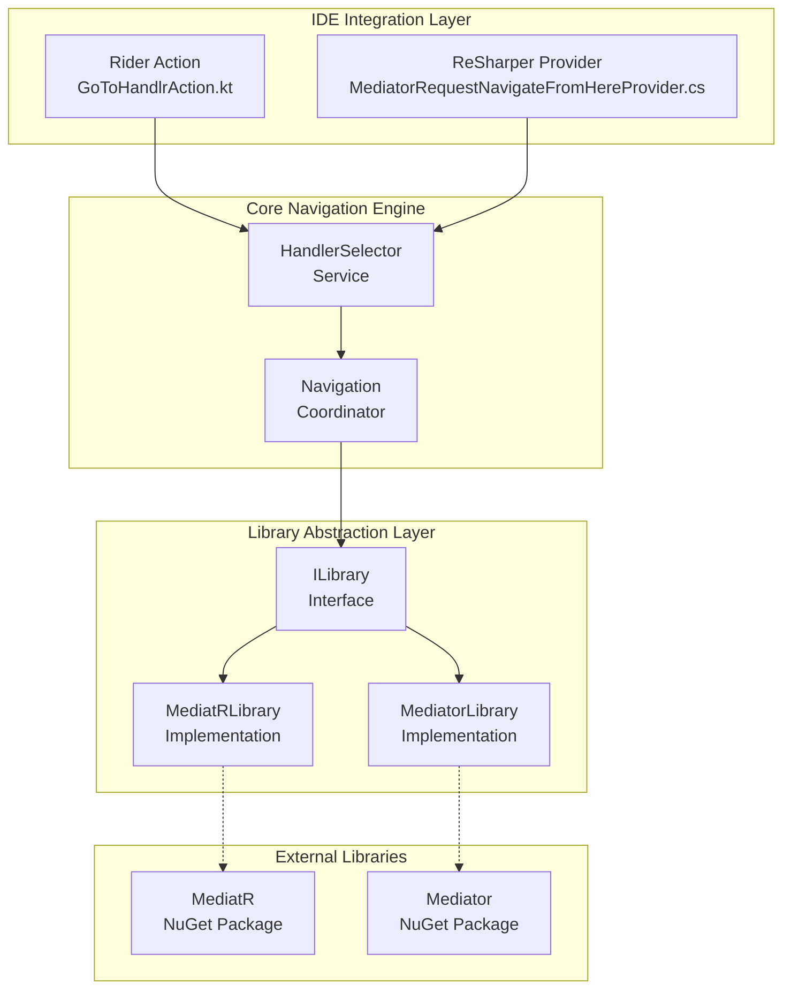

# ✨ MediatR Extensions for JetBrains Rider & ReSharper

[](https://plugins.jetbrains.com/plugin/18313-mediatr-extensions)
[](https://plugins.jetbrains.com/plugin/18347-mediatr-extensions)

Boost your navigation superpowers in Rider and ReSharper with this plugin for Mediator-based applications. Quickly jump between `IRequest`, `INotification`, and their respective handlers—like teleportation for your CQRS architecture.

---

## 🚀 Features

- Supports JetBrains Rider & ReSharper
- Navigate from `IRequest` / `INotification` to their handlers for both [MediatR](https://github.com/jbogard/MediatR) and [Mediator](https://github.com/martinothamar/Mediator) NuGet packages

---

## 🏗️ Plugin Architecture

### System Overview



### How It Works

#### Entry Points
The plugin provides two main entry points for navigation:

1. **Rider Integration** (`GoToHandlrAction.kt`): A Kotlin-based action that integrates with Rider's action system
2. **ReSharper Integration** (`MediatorRequestNavigateFromHereProvider.cs`): A C# provider that adds "Go to handler" to ReSharper's context navigation

#### High-Level Workflow

1. **Detection**: User right-clicks on an `IRequest` or `INotification` interface
2. **Context Analysis**: Plugin identifies the selected element and validates it's a mediator request/notification
3. **Library Resolution**: Determines whether the project uses MediatR or Mediator library
4. **Handler Discovery**: Searches the solution for corresponding `IRequestHandler` or `INotificationHandler` implementations
5. **Navigation**: Opens the handler class in the editor

#### Library Abstraction

The plugin uses an abstraction layer to support both MediatR and Mediator libraries:

**Common Interface (`ILibrary`)**:
- `FindHandlers()`: Locates handler implementations for a given request/notification
- `IsSupported()`: Determines if the library can handle the current context
- `CreateHandlrFor()`: Generates new handler classes (code generation feature)

**MediatR Support**:
- Handles `MediatR.IBaseRequest` and `MediatR.INotification`
- Supports `IRequestHandler<T>`, `IRequestHandler<T,TResponse>`, and `INotificationHandler<T>`
- Full integration with MediatR's interface contracts

**Mediator Support**:
- Handles `Mediator.IBaseRequest` and `Mediator.INotification`  
- Supports the same handler patterns as MediatR but for the Mediator library
- Provides identical functionality with different underlying type system

This abstraction allows the plugin to work seamlessly with both libraries without requiring users to configure which one they're using—the plugin automatically detects and adapts to the project's mediator implementation.

---

## 🖥️ How to Run

### 🪟 Windows

```powershell
# Open the solution
MediatorPlugin.slnx

# Ensure NuGet feed is available
https://api.nuget.org/v3/index.json

# In PowerShell:
./buildPlugin.ps1
./runVisualStudio.ps1
```

Once the new Visual Studio instance opens, go to:  
`ReSharper > Extension Manager`  
The MediatR extension should appear as version `9999.0`.

> 💡 You may need to remove the Rider project if it causes the build to fail.

---

### 🍏 macOS

```bash
./gradlew :runIde
```

---

## 👨‍💻 Contributions

Pull requests and plugin ideas are always welcome!  
If you're using this in your own workflow, we’d love to hear about it.

---

📦 JetBrains Marketplace:
- [Rider Plugin](https://plugins.jetbrains.com/plugin/18313-mediatr-extensions)
- [ReSharper Plugin](https://plugins.jetbrains.com/plugin/18347-mediatr-extensions)
